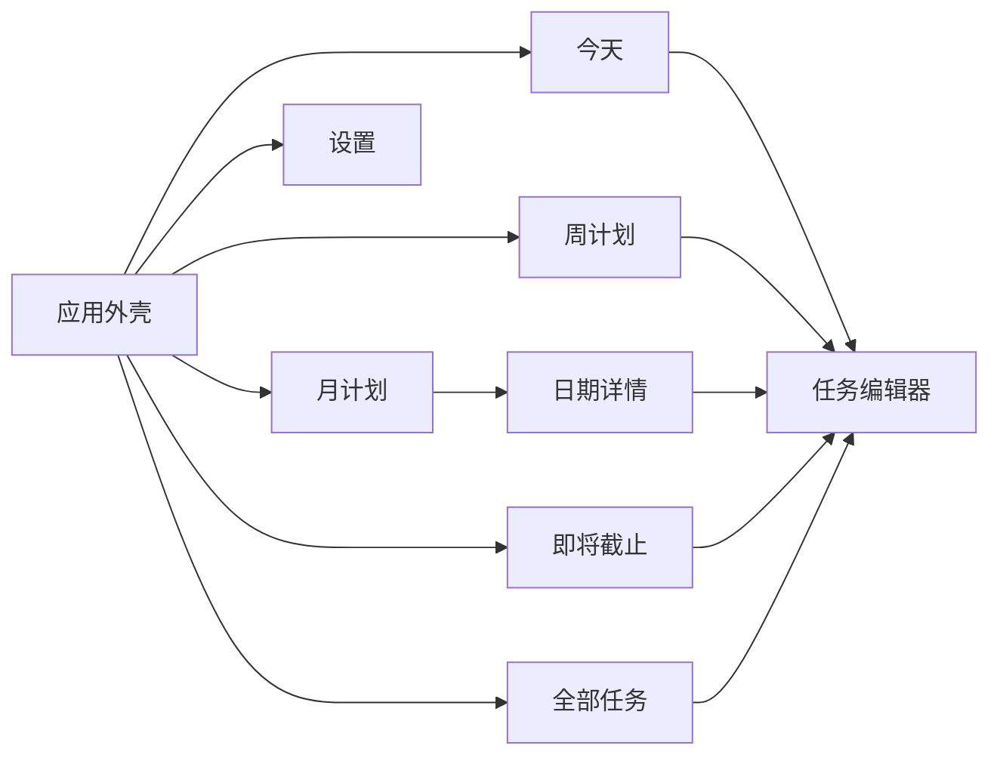
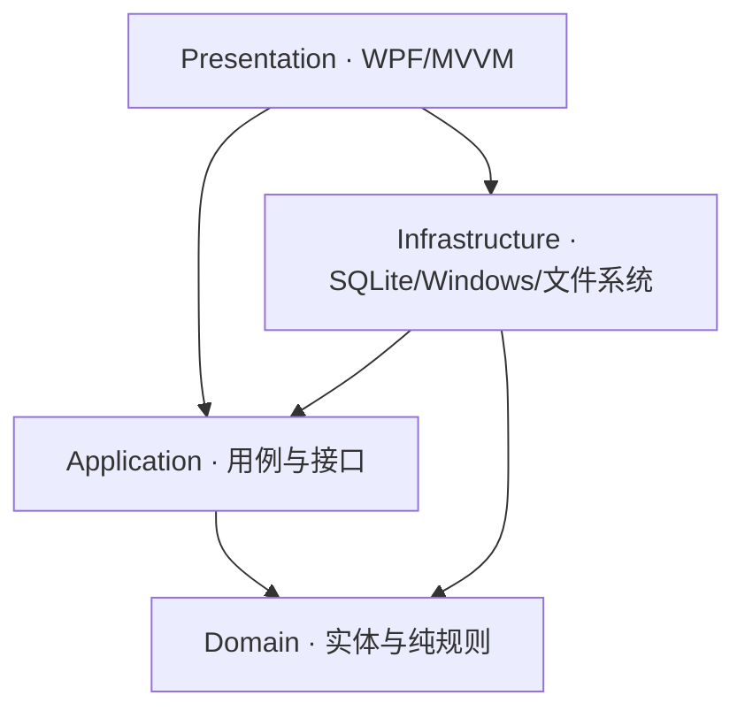
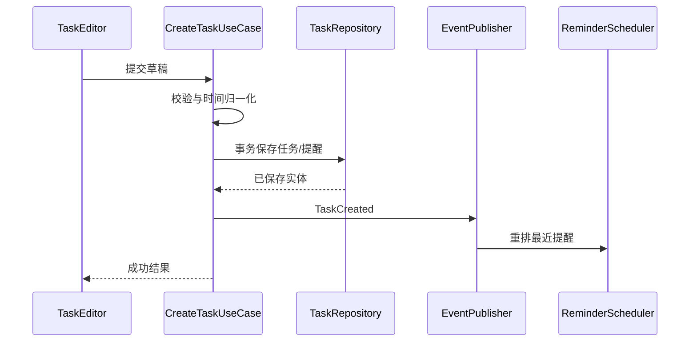
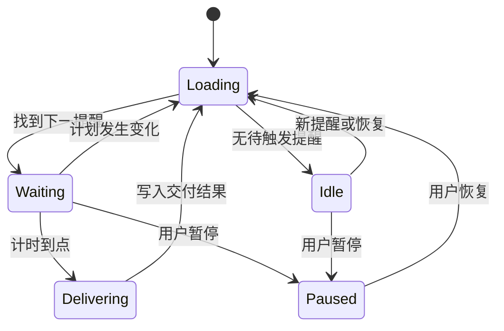
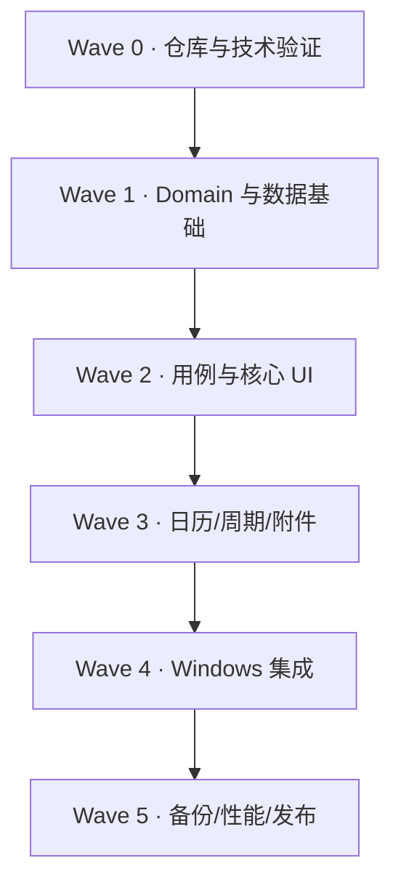

# ScheduleAssistant V1.0 产品、架构与协同开发规格说明书

> 文档状态：开发基线（Baseline）  
> 文档版本：1.0.0  
> 更新日期：2026-09-16  
> 目标平台：Windows 10 / Windows 11，x64  
> 主要技术路线：C#、现代 .NET、WPF、MVVM、SQLite  
> 适用对象：产品负责人、总控 Codex 会话、功能开发 Codex 会话、集成与测试会话

---

## 0. 文档用途与执行规则

本文件既是 ScheduleAssistant V1.0 的产品需求说明书，也是软件架构设计书、数据库设计书和多 Codex 会话协同开发任务书。项目开发期间，本文件是需求与技术决策的**单一事实源**。

所有参与编码的 Codex 会话在修改代码前都必须：

1. 完整阅读本文件；
2. 阅读仓库根目录的 `AGENTS.md`、`README.md` 和与任务相关的 ADR；
3. 明确自己领取的任务编号、允许修改的目录和禁止修改的范围；
4. 先检查现有实现和测试，不得假定接口尚不存在；
5. 不得擅自扩大 V1.0 范围；
6. 若规格存在冲突，停止编码并将冲突提交给总控会话，不得自行选择一种解释；
7. 交付时必须提供变更摘要、文件清单、验证命令、测试结果、已知问题和后续依赖。

### 0.1 规范关键词

- **必须**：V1.0 验收所需，不能省略。
- **应该**：原则上实现；若无法实现，必须说明原因和替代方案。
- **可以**：允许实现，但不得影响必须项的进度和稳定性。
- **不在 V1.0**：本版本明确不实现，仅预留扩展接口。

### 0.2 需求变更规则

冻结本基线后，任何新增需求均需记录为变更项，至少包含：

- 变更原因；
- 影响的需求编号；
- 数据库迁移影响；
- UI 与兼容性影响；
- 对现有任务包的影响；
- 是否进入 V1.0。

未经确认，不得以“顺手优化”为由加入云同步、账户系统、AI 规划、多人协作等功能。

### 0.3 已批准变更：DEV-043 核心 UI 体验修订

- 变更原因：Windows 实机测试发现字体、原生下拉框、任务编辑器信息密度和时间录入方式与目标扁平化体验不一致；即将截止视图的远期范围过大。
- 影响需求：FR-VIEW-005、6.2、6.4；即将截止页的最大可选未来范围改为 7 天，任务编辑器隐藏只读工作流状态，并调整时间选择与可选分区。
- 数据库/接口影响：无迁移、表结构或 Domain/Application 公共契约变更；既有 30 天和全部范围查询值继续供其他内部场景使用，但不在即将截止页暴露。
- UI 与兼容性影响：简体中文界面使用 Microsoft YaHei UI，并保留 Segoe UI Variable/Segoe UI 回退；开始、结束和 Deadline 时间改为四位数字选择器；“截止与提醒”和“内容”默认收起。
- 对现有任务包的影响：作为 DEV-041/DEV-042 完成后的 Presentation 修订，不回写或扩大原任务范围。
- V1.0 结论：进入 V1.0。

### 0.4 已批准变更：DEV-044 表单反馈与交互一致性修订

- 变更原因：Windows 实机测试发现任务编辑器在用户操作前就展示表单错误，两个可选分区在两列布局中出现视觉上的联动空白区域，时区提示和原生放弃确认框也与应用视觉系统不一致。
- 影响需求：6.4；调整任务编辑器的校验反馈时机、可选分区布局、提醒文案和放弃修改确认交互。
- 数据库/接口影响：无迁移、表结构或 Domain/Application 公共契约变更；“提醒时间”仅为现有提醒偏移字段的界面文案。
- UI 与兼容性影响：表单提示和错误红框仅在用户尝试非法保存后显示；“截止与提醒”和“内容”保持彼此独立的收起/展开状态且不拉伸未选中的同排分区；移除可选提示和本机时区提示；使用应用主题化的放弃修改对话框。
- 对现有任务包的影响：作为 DEV-043 的 Presentation 细化，不回写或扩大原任务范围。
- V1.0 结论：进入 V1.0。

### 0.5 已批准变更：DEV-045 编辑器滚动布局稳定性修订

- 变更原因：展开可选分区后，自动垂直滚动条改变编辑器可用宽度，使两列内容向左跳动，破坏布局稳定性。
- 影响需求：6.4；调整任务编辑器的垂直滚动条呈现方式，不改变分区内容或滚动能力。
- 数据库/接口影响：无迁移、表结构或 Domain/Application 公共契约变更。
- UI 与兼容性影响：编辑器垂直滚动条不再因内容展开而动态占用宽度；滚动条保持隐藏，用户仍可用鼠标滚轮、键盘或触控滚动，收起和展开状态下两列宽度保持稳定。
- 对现有任务包的影响：作为 DEV-044 的 Presentation 布局修订，不回写或扩大原任务范围。
- V1.0 结论：进入 V1.0。

### 0.6 已批准变更：DEV-046 可选分区等高修订

- 变更原因：同时展开“截止与提醒”和“内容”时，两侧字段数量不同导致卡片高度不一致，破坏两列编辑器的视觉对齐。
- 影响需求：6.4；调整两个可选分区在同时展开时的垂直对齐规则。
- 数据库/接口影响：无迁移、表结构或 Domain/Application 公共契约变更。
- UI 与兼容性影响：两个分区同时展开时共享同一 Grid 行高并等高；只展开一侧时，另一侧仍保持收起卡片高度，不产生空白拉伸。
- 对现有任务包的影响：作为 DEV-045 的 Presentation 布局细化，不回写或扩大原任务范围。
- V1.0 结论：进入 V1.0。

### 0.7 已批准变更：DEV-047 可选分区展开高度稳定性修订

- 变更原因：仅展开“截止与提醒”时，其自然内容高度小于“内容”分区；之后展开“内容”会使同排行高增加，导致截止卡片视觉跳变。
- 影响需求：6.4；为展开状态预留稳定的可选分区高度。
- 数据库/接口影响：无迁移、表结构或 Domain/Application 公共契约变更。
- UI 与兼容性影响：任一可选分区展开时均预留与内容分区一致的最小高度，截止卡片在内容展开前后保持稳定；两个分区同时展开时仍等高，收起时恢复紧凑高度。
- 对现有任务包的影响：作为 DEV-046 的 Presentation 布局细化，不回写或扩大原任务范围。
- V1.0 结论：进入 V1.0。

---

## 1. 产品定义

### 1.1 产品定位

ScheduleAssistant 是一款供单个用户长期使用的 Windows 本地日程与截止日期管理软件。它同时承担四类职责：

1. 管理待办事项和执行计划；
2. 通过日、周、月视图呈现时间安排；
3. 持续追踪 Deadline、倒计时和提醒；
4. 以低资源占用方式常驻系统托盘，并可切换为可交互的桌面看板。

本软件不是团队项目管理平台，不依赖服务器，不要求登录。所有业务数据默认保存在本机。

### 1.2 核心产品原则

1. **计划时间与截止时间分离**：什么时候做和最晚什么时候完成是两个独立概念。
2. **历史信息不被自动篡改**：未完成任务持续保留，不自动顺延计划日期。
3. **类型与紧迫度分离**：类型决定卡片基础颜色，优先级和临近截止状态决定边框、图标与警示色。
4. **本地优先**：离线可完整使用；数据库、附件、设置和备份均在本机。
5. **低打扰常驻**：后台运行时主要由事件和单次计时器驱动，不进行秒级全量轮询。
6. **可替换基础设施**：数据库、通知、附件、开机启动、桌面宿主等均通过接口隔离。
7. **渐进式交付**：先实现可靠的任务闭环，再逐步接入系统能力。

### 1.3 目标用户与运行假设

- 单用户、单台 Windows 电脑优先；
- 不考虑多人协作、权限分级和共享数据库；
- 默认系统区域和时区为用户当前 Windows 设置；
- 主窗口可以关闭到托盘，后台提醒继续工作；
- 用户可能保存数年任务，数据量按 10,000～50,000 条任务设计；
- 用户可能将电脑休眠、关机或跨越提醒时间，应用恢复后必须补偿检查。

### 1.4 V1.0 成功标准

用户能够完成以下闭环：

1. 创建含计划日期、截止时间、地点、材料和附件的任务；
2. 在今天、七列周历和月历中看到任务；
3. 清楚区分任务的计划日与 Deadline；
4. 在醒目区域看到最近截止事项的倒计时；
5. 截止前一天收到 Windows 本地通知；
6. 在主界面或桌面看板勾选完成；
7. 创建每月固定日期的周期任务，并在后续月份自动看到实例；
8. 关闭主窗口后应用仍可在托盘运行；
9. 开机登录后应用可静默启动；
10. 重启程序后全部数据、状态、附件关系和设置保持不变。

---

## 2. 范围定义

### 2.1 V1.0 必须实现

| 模块 | 范围 |
|---|---|
| 任务管理 | 新增、查看、编辑、删除、完成/取消完成、开始处理 |
| 任务字段 | 标题、类型、优先级、工作流状态、计划日期、计划开始/结束时间、Deadline、地点、具体事务、材料准备、备注 |
| 附件 | 多附件导入、打开、定位、移除；支持常见图片、PDF、Word、Excel、PPT、压缩包和任意普通文件 |
| 视图 | 今天、指定日期、七列周历、月历、即将截止、全部任务 |
| 周期任务 | 每日、每周指定星期、每月指定日期、每年指定日期 |
| 倒计时 | 最近 Deadline 醒目展示；按剩余时间分级着色；逾期持续显示 |
| 提醒 | 默认截止前 1 天本地通知；提醒触发、去重和休眠恢复补偿 |
| 桌面模式 | 极简看板、显示今日与最近截止、直接完成任务、打开主应用 |
| Windows 集成 | 单实例、系统托盘、关闭到托盘、彻底退出、开机自启动 |
| 本地存储 | SQLite、版本化迁移、异常恢复提示 |
| 备份 | 自动数据库备份、手动完整导出、基本恢复流程 |
| 设置 | 自启动、关闭行为、提醒默认值、桌面模式、主题和数据位置只读展示 |
| 工程质量 | 分层架构、依赖注入、结构化日志、核心逻辑测试、可重复构建 |

### 2.2 明确不在 V1.0

- 用户账户和登录；
- 云同步、手机同步、局域网同步；
- 多人协作、共享清单、评论；
- Google Calendar、Outlook、Todoist 等第三方同步；
- 子任务和任务依赖图；
- AI 自动排程与自然语言创建任务；
- 番茄钟、习惯打卡；
- 移动端、Web 端、macOS、Linux；
- 复杂 RRULE 全集和任意自然语言周期；
- 真正替换系统壁纸文件；
- 在线附件预览和 Office 文档内嵌编辑；
- 自动更新服务和应用商店发布。

### 2.3 V1.0 后预留但不得提前实现

- 多提醒节点；
- 通知中的“稍后提醒”；
- 子任务、标签、模板；
- 数据统计和智能今日计划；
- 云端仓储实现；
- 日历导入导出（ICS）；
- MSIX/Store 正式分发管线。

---

## 3. 术语与业务语义

| 术语 | 唯一定义 |
|---|---|
| 计划日期 | 用户打算执行任务的本地日期，可为空 |
| 计划时间 | 计划日期内的开始和结束时间，可为空；有时间必须先有计划日期 |
| Deadline | 任务最晚应完成的时间点，可为空，独立于计划日期 |
| 工作流状态 | `Pending`、`InProgress`、`Completed`；由用户行为改变 |
| 展示状态 | 根据工作流状态、计划日期和 Deadline 动态计算的 UI 状态，不全部写入数据库 |
| 逾期 | 未完成且 Deadline 早于当前时间 |
| 计划已过 | 未完成、计划日期早于今天，但没有发生 Deadline 逾期；不能等同于 Deadline 逾期 |
| 类型 | 科研、课程、会议、行政、生活、其他等业务分类，可配置颜色 |
| 优先级 | 紧急且重要、重要、一般、低优先级 |
| 周期系列 | 用于定义重复规律和公共字段的模板 |
| 周期实例 | 周期系列在某一发生日期生成的实际任务，可独立完成 |
| 桌面模式 | 可交互的桌面看板窗口，不是静态壁纸图片 |
| 关闭到托盘 | 隐藏主窗口但不终止进程，提醒调度器继续运行 |
| 彻底退出 | 停止调度器、释放资源并结束进程 |

### 3.1 展示状态计算优先级

按以下顺序计算，命中后停止：

1. `WorkflowStatus == Completed` → 已完成；
2. `DeadlineUtc < NowUtc` → 已逾期；
3. `WorkflowStatus == InProgress` → 进行中；
4. `PlannedDate < TodayLocal` → 计划已过但未完成；
5. 其他 → 未开始。

“已逾期”是时间驱动的派生状态，**不得**被当作可由用户手动设置的持久化工作流状态。

---

## 4. 功能需求

### 4.1 任务管理

#### FR-TASK-001 新建任务

用户必须能够从主界面、托盘菜单、日视图、周视图、月视图和桌面模式进入新建任务窗口。

最少必填字段只有标题。不同入口可以预填上下文：

- 从某日打开：预填计划日期；
- 从周历某列打开：预填该列日期；
- 从月历某日打开：预填该日；
- 从“即将截止”打开：不擅自预填 Deadline；
- 从托盘“新增事项”打开：空白表单。

验收条件：

- 空标题不能保存；
- 标题去除首尾空白后长度为 1～200 个字符；
- 保存成功后相关视图只刷新受影响日期，不全量重启应用；
- 保存失败时表单内容保留，显示可理解错误，不关闭窗口。

#### FR-TASK-002 编辑任务

用户必须能够编辑除 ID、创建时间外的业务字段。采用乐观并发版本号，若同一任务已被另一窗口修改，应提示重新加载，不得静默覆盖。

#### FR-TASK-003 删除任务

删除前必须二次确认。普通任务删除后从数据库移除；附件删除策略见 FR-ATT-005。周期实例和周期系列的删除规则见 4.5。

#### FR-TASK-004 完成与取消完成

- 勾选任务时，将工作流状态置为 `Completed` 并记录 `CompletedAtUtc`；
- 取消勾选时，将状态恢复为 `Pending`，清空 `CompletedAtUtc`；
- 完成周期实例只影响该实例；
- 完成操作必须可从今天、周、月详情、全部任务和桌面看板执行；
- 完成后与该任务相关的未触发提醒必须取消。

#### FR-TASK-005 开始处理

用户可将任务从 `Pending` 改为 `InProgress`。已完成任务如需继续处理，应先取消完成。

#### FR-TASK-006 未完成任务持续保留

程序不得自动修改未完成任务的计划日期，不得在跨日后隐藏或删除任务。今天页顶部单独展示：

- 已逾期任务；
- 计划已过但未完成任务。

两组必须有不同文案，避免把“原计划未执行”误称为“Deadline 逾期”。

#### FR-TASK-007 字段校验

- 有计划开始/结束时间时必须有计划日期；
- 同时存在开始和结束时间时，结束时间不得早于开始时间；
- Deadline 可早于计划日期，但必须弹出非阻断式确认，避免误填；
- 地点最长 300 字符；
- 具体事务、材料准备、备注分别最多 10,000 字符；
- 数据层必须重复执行关键校验，不能只依赖 UI。

### 4.2 类型、颜色与优先级

#### FR-CAT-001 默认类型

首次启动创建以下默认类型，具体色值集中定义在主题资源中：科研、课程、会议、行政、生活、其他。

#### FR-CAT-002 类型管理

用户可以新增、重命名、调整颜色和排序。被任务引用的类型不能直接物理删除；删除时必须要求将现有任务迁移到另一类型，或将类型标记为停用。

#### FR-CAT-003 视觉编码

- 卡片左侧色条或小面积底色表示类型；
- 优先级使用图标、标签或边框粗细表示；
- 距 Deadline 的紧迫度使用统一警示色表示；
- 不允许整张卡片用高饱和红色覆盖类型信息；
- 所有颜色必须同时有文字/图标语义，不能只靠颜色区分。

紧迫度默认分级：

| 条件 | 级别 | 建议视觉 |
|---|---:|---|
| 剩余超过 7 天 | 0 | 中性 |
| 剩余 3～7 天 | 1 | 黄色提示 |
| 剩余 1～3 天 | 2 | 橙色提示 |
| 剩余不足 24 小时 | 3 | 红色提示 |
| 已逾期 | 4 | 深红色 + “已逾期”文本 |

临界点必须由同一个 `DeadlineUrgencyCalculator` 计算，禁止每个 ViewModel 自行实现。

### 4.3 日、周、月和查询视图

#### FR-VIEW-001 今天视图

今天页按以下区块展示：

1. 最近 Deadline 倒计时；
2. 已逾期；
3. 计划已过但未完成；
4. 今日计划；
5. 今日 Deadline；
6. 已完成（默认折叠）。

同一任务既在今天计划又在今天截止时，可以只显示一张主卡，但卡片上必须同时显示“计划”和“今日截止”标识；不可让用户误以为是两项不同任务。

#### FR-VIEW-002 指定日期视图

用户从日历选择任意日期后，看到该日的计划任务和 Deadline。过去未完成任务不会自动混入任意历史日期，只保留在其原日期，并在今天页的待处理区聚合。

#### FR-VIEW-003 七列周历

- 周一至周日固定七列；
- 每列显示日期、当日计划卡片和 Deadline 标记；
- 计划项使用“●”语义图标，Deadline 使用“◆”语义图标或等价矢量图标；
- 同一任务若计划日和截止日不同，应分别出现在相应日期；
- 同日时合并卡片展示两个标记；
- 列内优先按全天/无时间、开始时间、优先级排序；
- 支持上一周、下一周、回到本周；
- 每列必须独立滚动或整周统一滚动，选择一种后全局一致；V1 推荐整周统一垂直滚动、列宽稳定。

#### FR-VIEW-004 月历

- 标准 6 行 × 7 列月历；
- 每格显示最多 3 个高价值条目，超出显示“+N”；
- 排序优先级：今日 Deadline/逾期、关键优先级、带时间计划、其他；
- 点击“+N”打开该日详情，不在狭小单元格内无限展开；
- 支持上一月、下一月、回到本月；
- 必须显示相邻月份补位日期，但降低视觉权重。

#### FR-VIEW-005 即将截止

只显示未完成且存在 Deadline 的任务，默认按 Deadline 升序、优先级降序排序。默认展示未来 7 天，支持范围：24 小时、3 天、7 天；页面不得提供超过 7 天的未来范围。

#### FR-VIEW-006 全部任务

支持关键词搜索以及按类型、优先级、工作流状态、是否逾期筛选。搜索至少覆盖标题、地点、具体事务、材料准备和备注。

#### FR-VIEW-007 空状态与加载状态

所有视图都必须具备：加载中、无数据、加载失败、正常数据四种明确状态。数据库查询不得在 UI 线程执行。

### 4.4 Deadline 与倒计时

#### FR-DDL-001 倒计时内容

主界面顶部显示最近的未完成 Deadline：

- 标题；
- 准确 Deadline；
- 剩余天、小时或分钟；
- 紧迫度；
- 点击后打开任务详情。

主倒计时下方最多显示另外 3 个即将截止任务。无 Deadline 时显示轻量空状态，不占用过大空间。

#### FR-DDL-002 刷新频率

- 剩余大于 24 小时：每分钟刷新显示足够；
- 剩余 1～24 小时：每分钟刷新；
- 剩余不足 1 小时：仍以每分钟刷新为默认；
- 不允许为了秒级跳动每秒重查数据库；
- Deadline 到点时必须立即重新计算排序和紧迫度，可使用针对最近 Deadline 的单次计时器。

#### FR-DDL-003 排序与并列

按 Deadline 升序，Deadline 相同按优先级降序，再按创建时间升序。已完成任务立即退出倒计时列表。

### 4.5 周期任务

#### FR-REC-001 支持的规则

V1.0 支持：

- 每日；
- 每周一个或多个星期；
- 每月某日；
- 每年某月某日。

V1.0 的周期间隔固定为 1，不支持“每 2 周”等自定义间隔。

#### FR-REC-002 无效日期策略

- “每月 31 日”遇到不足 31 天的月份时，落在该月最后一天；
- “每年 2 月 29 日”遇到非闰年时，落在 2 月最后一天；
- UI 必须在创建规则时显示该策略。

#### FR-REC-003 实例生成

采用“系列定义 + 实例物化”的混合模式：

- 周期系列保存公共字段和规则；
- 周期实例作为普通任务保存，可独立完成；
- 启动、跨日和日历查询时，幂等生成所需时间窗口实例；
- 默认物化窗口为今天前 31 天至今天后 400 天；
- 查询超出窗口时按需扩展；
- 数据库必须通过唯一约束防止同一系列同一发生日期生成重复实例。

#### FR-REC-004 编辑实例

编辑某一周期实例时，只修改该实例并标记为覆盖项，不改变系列规则。

#### FR-REC-005 编辑系列

V1.0 提供“修改此后未完成实例”语义：

- 已完成实例和过去实例保持不变；
- 从用户指定生效日期起，删除尚未完成且未被单独覆盖的未来实例并重新物化；
- 已单独覆盖的未来实例保留，并提示用户它们不随系列更新；
- 该操作必须在事务中完成。

#### FR-REC-006 删除周期内容

- 删除单个实例：写入排除记录，防止下次物化重新生成；
- 删除未来实例：停用系列的未来部分，并删除未完成且未覆盖的未来实例；
- 已完成历史实例默认保留；
- UI 必须明确询问删除范围。

### 4.6 提醒与通知

#### FR-REM-001 默认提醒

创建带 Deadline 的任务时，默认添加“截止前 1 天”提醒。用户可以关闭该任务的提醒。V1.0 UI 只要求支持一个相对提醒节点，数据结构必须允许未来一项任务多个提醒。

#### FR-REM-002 调度机制

提醒调度器必须：

1. 从数据库读取最近一条待触发提醒；
2. 使用单次计时器等待，而非循环扫描全部任务；
3. 触发后持久化交付状态；
4. 重新计算下一条提醒；
5. 在任务、Deadline、提醒设置变化后重新调度；
6. 使用注入的 `TimeProvider`，确保可测试。

#### FR-REM-003 休眠、关机与漏发补偿

应用启动、解锁或系统恢复时，检查仍处于待触发状态且计划时间已过的提醒：

- 过去 24 小时内：补发一次，并标注“提醒时间已过”；
- 超过 24 小时：不弹出陈旧通知，但记录为 `Expired`；
- 对已完成或已删除任务不得补发；
- 去重键必须防止重复补发。

#### FR-REM-004 通知交互

V1.0 通知至少包含任务标题、Deadline、剩余时间或逾期状态。点击通知应激活已有单实例并打开任务详情。若通知激活路径无法在首个技术验证中稳定实现，V1.0 最低可接受回退为激活主窗口并定位到“即将截止”，但必须记录 ADR。

#### FR-REM-005 降级行为

当系统通知被关闭、不支持或注册失败时：

- 应用不能崩溃；
- 托盘图标和主界面显示提醒异常状态；
- 日志记录具体错误；
- 应提供“发送测试通知”用于诊断。

### 4.7 附件与材料

#### FR-ATT-001 附件存储策略

数据库只保存附件元数据，不保存二进制内容。V1.0 默认将用户选择的文件复制到应用管理目录，而不是只保存原文件绝对路径，以降低源文件移动造成的失效风险。

目录建议：

```text
%LocalAppData%/ScheduleAssistant/
├─ data/schedule.db
├─ attachments/{task-id}/{attachment-id}_{safe-file-name}
├─ backups/
├─ logs/
└─ settings/
```

#### FR-ATT-002 支持范围

允许选择任意普通文件。应用不负责解析或内嵌渲染，点击后由 Windows 默认程序打开。文件选择器应提供常见文档和图片筛选，同时保留“所有文件”。

#### FR-ATT-003 导入一致性

附件导入流程：

1. 验证源文件存在且可读；
2. 生成附件 ID 和安全文件名；
3. 复制到临时文件；
4. 计算大小，可选计算 SHA-256；
5. 原子移动到最终位置；
6. 数据库事务写入元数据；
7. 任一步失败时清理临时文件并保留任务编辑内容。

数据库提交和文件系统无法形成真正的分布式事务，因此基础设施层必须提供补偿清理与启动时孤儿文件诊断。

#### FR-ATT-004 附件操作

支持打开、在资源管理器中显示、重新命名显示名、移除。源文件名、存储相对路径、MIME/扩展名、大小、导入时间必须记录。

#### FR-ATT-005 删除策略

- 删除附件：确认后删除管理副本和元数据；
- 删除任务：在数据库事务成功后清理任务附件目录；
- 清理失败不回滚任务删除，但记录待清理项并在下次启动重试；
- 不得删除用户最初选择的源文件。

#### FR-ATT-006 材料准备

“材料准备”在 V1.0 是多行纯文本字段，不实现可勾选子清单。该字段与附件区并列展示。

### 4.8 系统托盘与应用生命周期

#### FR-LIFE-001 单实例

应用必须保证同一 Windows 用户会话内只有一个业务实例。第二次启动时，通过命名互斥量检测现有实例，并通过本地 IPC 将激活参数传给首实例，然后退出。

激活参数至少包括：

- 打开主窗口；
- 新建任务；
- 打开指定任务；
- 静默后台启动。

#### FR-LIFE-002 关闭行为

默认点击主窗口关闭按钮时隐藏到托盘。第一次发生时显示一次性说明。设置中可改为：

- 关闭到托盘；
- 询问；
- 彻底退出。

#### FR-LIFE-003 托盘菜单

至少包含：今日计划、新增事项、桌面模式、暂停提醒/恢复提醒、打开主界面、彻底退出。

#### FR-LIFE-004 安全退出

彻底退出时：

1. 停止接收新命令；
2. 取消调度计时器；
3. 等待正在进行的短事务完成；
4. 释放托盘图标和数据库连接；
5. 写入正常退出日志；
6. 结束进程。

### 4.9 开机自启动

#### FR-START-001 用户级启动

开机自启动必须是当前用户级别，不要求管理员权限。默认使用 `HKCU\Software\Microsoft\Windows\CurrentVersion\Run`，值指向带引号的可执行文件完整路径并附加 `--background` 参数。

#### FR-START-002 设置一致性

- 开关开启：写入或修复注册表值；
- 开关关闭：仅删除本应用自己的值；
- 应用路径变化时能够检测并更新；
- 读取失败或被安全软件阻止时显示错误，不伪装成成功。

#### FR-START-003 静默启动

通过 `--background` 启动时不显示主窗口，仅初始化数据库、调度器和托盘。若数据库迁移失败或存在必须用户处理的错误，允许显示恢复窗口。

### 4.10 桌面模式

#### FR-DESK-001 内容

桌面看板显示：

- 当前日期与星期；
- 今日计划；
- 已逾期/计划已过摘要；
- 最近 3 个 Deadline；
- 完成勾选；
- 新建任务和打开主界面入口。

#### FR-DESK-002 视觉与交互

- 无边框、极简扁平、可调透明度；
- 不使用持续动画和模糊特效作为必要表现；
- 支持拖动位置、调整大小、记住布局；
- 任务列表必须可键盘访问；
- 完成任务后即时更新主窗口；
- 在桌面嵌入不可用时回退为普通无边框桌面小组件。

#### FR-DESK-003 技术风险隔离

Windows 的 WorkerW/Progman 桌面嵌入路径依赖非正式桌面窗口结构，必须封装在 `IDesktopHostService` 后并先做技术验证。业务 View 和 ViewModel 不得直接调用 Win32 句柄 API。

桌面宿主必须返回明确能力状态：

- `Embedded`：已嵌入桌面层；
- `WidgetFallback`：使用普通小组件回退；
- `Unavailable`：不可用并附原因。

#### FR-DESK-004 多显示器与桌面刷新

V1.0 至少支持主显示器。若显示器断开、分辨率变化或 Explorer 重启，应恢复到可见区域；无法重新嵌入时使用回退模式，不得丢失窗口。

### 4.11 备份、恢复与诊断

#### FR-BACK-001 自动数据库备份

- 每日首次成功启动后执行一次一致性数据库备份；
- 使用 SQLite 备份 API 或等价一致性机制，不允许在数据库使用中直接复制主文件；
- 默认保留最近 14 个每日备份；
- 清理只作用于本应用备份目录；
- 自动备份不重复复制附件，UI 必须明确说明。

#### FR-BACK-002 手动完整导出

用户可以导出一个完整归档，包含：数据库快照、受管附件、版本清单和校验清单。导出到用户选择的位置；不得覆盖现有文件，除非用户明确确认。

#### FR-BACK-003 恢复

恢复必须在停止调度和关闭数据库连接后执行。恢复前自动创建当前状态安全快照。若归档版本高于当前应用可支持的 schema 版本，必须拒绝恢复并给出提示。

#### FR-BACK-004 日志

采用结构化滚动日志，默认保留 14 天。日志不得记录任务正文、附件内容或其他不必要隐私数据；允许记录任务 ID、操作类型、耗时、异常类型。

---

## 5. 非功能需求

### 5.1 性能预算

以下为目标预算，需在发布候选版实测并记录机器配置：

| 指标 | 目标 |
|---|---:|
| 托盘空闲 CPU | 5 分钟平均低于 0.5%（常见四核以上电脑） |
| 主窗口关闭后的私有内存 | 目标低于 150 MB；超出必须分析 |
| 温启动到托盘可用 | 2 秒内 |
| 打开今天视图 | 10,000 条任务数据下 300 ms 内出现首屏 |
| 周/月切换查询 | 常规数据量下 200 ms 级；不得冻结 UI |
| 新建/完成单个任务 | 本地操作感知延迟低于 150 ms |
| 后台数据库轮询 | 禁止固定 1 秒轮询；普通空闲期不得持续全表扫描 |

测量以 Release、x64、非调试器附加状态为准。

### 5.2 可靠性

- 所有数据库写操作使用事务；
- 启用 SQLite WAL 模式和外键约束；
- 数据库迁移可重复、按版本执行，失败时不启动业务写入；
- 所有后台异常必须被捕获、记录并转换为用户可理解状态；
- UI 线程不得执行文件复制、大查询、备份和迁移；
- 关键计时逻辑使用 `TimeProvider`，不可直接散落调用 `DateTime.Now`；
- 进程崩溃后，下次启动执行数据库完整性与附件孤儿快速检查。

### 5.3 可维护性

- 启用 nullable reference types；
- Release/CI 将编译警告视为错误，允许明确、局部、有注释的豁免；
- 每个公共接口和复杂业务规则必须有 XML 文档或相邻设计说明；
- View 的 code-behind 只允许纯 UI 行为和 Windows 互操作桥接，不允许业务逻辑和 SQL；
- 单文件原则上不超过 500 行；超过时必须说明其内聚性，不机械拆分；
- 不允许 Service Locator、全局可变单例和静态数据库访问；
- 异步方法接受合理的 `CancellationToken`；
- 不得使用 `async void`，事件处理器除外；事件处理器需捕获异常。

### 5.4 可测试性

- Domain 不依赖 WPF、数据库或系统时间；
- Application 通过接口依赖持久化和 Windows 能力；
- 规则计算器必须使用表驱动单元测试；
- 数据库仓储使用临时 SQLite 文件做集成测试，不以 mock 代替 SQL 验证；
- Windows 通知、注册表和桌面嵌入通过适配器测试，不在核心测试中直接操作真实系统。

### 5.5 可访问性与可用性

- 正文与背景满足合理对比度；
- 所有关键操作可通过键盘访问；
- 图标必须有 Tooltip 或 Automation Name；
- 不仅依赖颜色传递状态；
- 删除、恢复、覆盖等高风险操作明确确认；
- 日期与时间按 Windows 当前区域格式显示，数据库内部格式不受区域影响。

### 5.6 隐私与安全

- 不联网也能工作；
- V1.0 不上传遥测；
- 不记录任务正文到日志；
- 打开附件前验证最终路径仍位于受管附件根目录，防止路径穿越；
- 归档恢复时拒绝 `../`、绝对路径和符号链接逃逸；
- 文件名需要清洗，但界面保留原始显示名；
- 注册表只修改本应用的当前用户启动项。

---

## 6. UX 信息架构与页面行为

### 6.1 页面结构



### 6.2 主窗口布局

主窗口采用三段式结构：

| 区域 | 内容 | 行为 |
|---|---|---|
| 左侧导航 | 今天、周、月、即将截止、全部任务、设置 | 固定显示，不提供折叠入口 |
| 顶部 | 当前页面标题、日期导航、搜索、新建按钮 | 页面相关命令 |
| 主内容区 | 倒计时和当前视图 | 支持加载/空/错误状态 |

视觉风格：极简、扁平、低阴影、低动画。简体中文界面以 `Microsoft YaHei UI` 为主字体，并以 `Segoe UI Variable`、`Segoe UI` 回退。颜色、间距、圆角、字号必须来自统一资源字典，不允许在各 XAML 文件散落硬编码。

### 6.3 任务卡片最小信息

任务卡片根据空间展示以下内容：

1. 完成复选框；
2. 标题；
3. 计划时间；
4. Deadline 标记；
5. 类型色条；
6. 优先级；
7. 地点和附件数量（空间允许时）；
8. 逾期或计划已过文本。

月历紧凑卡片可仅显示标题、类型色条、计划/Deadline 图标和时间。

### 6.4 任务编辑器分区

| 分区 | 字段 |
|---|---|
| 基本信息 | 标题、类型、优先级 |
| 执行计划 | 计划日期、开始时间、结束时间、地点 |
| 截止与提醒 | Deadline、是否提醒、提醒时间 |
| 内容 | 具体事务、材料准备、备注 |
| 周期 | 是否重复、规则、生效日期、结束规则（V1 默认无结束） |
| 附件 | 导入、打开、定位、移除 |

编辑器必须支持取消。取消时若有未保存修改，弹出“放弃修改”确认。

编辑器不重复展示只读工作流状态；状态仍由开始处理、完成和取消完成等显式任务动作维护。计划开始、计划结束和 Deadline 时间使用四位数字选择器分别选择 `HH:mm` 的四个数字，不使用自由文本框。“截止与提醒”和“内容”是彼此独立的可选分区，默认收起、由用户分别展开；未展开的同排分区不得因另一分区展开而出现空白拉伸，同时展开时两个分区共享同一行高并等高，任一分区展开时均预留与内容分区一致的最小高度，避免截止卡片在另一分区展开后跳变。表单提示和字段错误红框只在用户尝试非法保存后显示，初始编辑状态不显示校验错误。界面使用“提醒时间”文案，不展示本机时区提示；放弃未保存修改时使用与应用主题一致的确认对话框。编辑器垂直滚动条保持隐藏，滚动仍可通过鼠标滚轮、键盘或触控进行，且不得因分区展开改变两列可用宽度。两列中的同排分区应等宽并尽量等高。

### 6.5 桌面看板信息密度

桌面看板默认尺寸约为普通便笺/侧栏面板，不复制完整主界面。只呈现当下需要的信息。列表超出时使用滚动，并提供“查看更多”跳转主窗口。

---

## 7. 软件架构

### 7.1 架构风格

采用分层架构 + MVVM + 端口/适配器思想。依赖方向只能由外向内：



`Presentation -> Infrastructure` 只允许发生在组合根进行依赖注入注册，不允许 ViewModel 直接依赖具体仓储或 Windows 适配器。

### 7.2 解决方案结构

```text
ScheduleAssistant/
├─ ScheduleAssistant.sln
├─ Directory.Build.props
├─ Directory.Packages.props
├─ README.md
├─ AGENTS.md
├─ docs/
│  ├─ specifications/
│  ├─ adr/
│  ├─ handoffs/
│  └─ test-reports/
├─ src/
│  ├─ ScheduleAssistant.Domain/
│  │  ├─ Entities/
│  │  ├─ Enums/
│  │  ├─ ValueObjects/
│  │  ├─ Rules/
│  │  └─ Events/
│  ├─ ScheduleAssistant.Application/
│  │  ├─ Abstractions/
│  │  ├─ Tasks/
│  │  ├─ Calendar/
│  │  ├─ Recurrence/
│  │  ├─ Reminders/
│  │  ├─ Attachments/
│  │  ├─ Backup/
│  │  └─ Common/
│  ├─ ScheduleAssistant.Infrastructure/
│  │  ├─ Persistence/
│  │  ├─ Migrations/
│  │  ├─ Repositories/
│  │  ├─ Notifications/
│  │  ├─ FileSystem/
│  │  ├─ Backup/
│  │  └─ WindowsIntegration/
│  └─ ScheduleAssistant.Presentation/
│     ├─ Views/
│     ├─ ViewModels/
│     ├─ Controls/
│     ├─ Behaviors/
│     ├─ Converters/
│     ├─ Resources/
│     └─ Composition/
└─ tests/
   ├─ ScheduleAssistant.Domain.Tests/
   ├─ ScheduleAssistant.Application.Tests/
   ├─ ScheduleAssistant.Infrastructure.Tests/
   └─ ScheduleAssistant.Architecture.Tests/
```

### 7.3 技术选型基线

| 领域 | 选择 | 约束 |
|---|---|---|
| 语言与运行时 | C# + 当前稳定 LTS .NET | 首次建仓时固定 SDK，使用 `global.json` |
| UI | WPF | 不混用 WinUI 控件树 |
| 模式 | MVVM | 可使用 CommunityToolkit.Mvvm，版本集中管理 |
| DI/生命周期 | Microsoft.Extensions.Hosting/DI | 只有一个 Composition Root |
| 数据库 | SQLite | WAL、外键、事务、版本化迁移 |
| 数据访问 | Microsoft.Data.Sqlite + Dapper | 显式 SQL，不使用重量级追踪 ORM |
| 日志 | Microsoft.Extensions.Logging + 文件 Provider | Provider 由实现任务确认，不泄露正文 |
| 测试 | xUnit | 断言库和 mock 库需集中固定版本 |
| 通知 | Windows App SDK 本地 App Notifications | 先完成 SPIKE-001 |
| 托盘 | WinForms `NotifyIcon` 适配器或验证后的轻量实现 | WPF 业务层不得依赖 WinForms |

依赖版本由基础工程任务一次性选择并写入 `Directory.Packages.props`。其他会话不得自行升级包。

### 7.4 核心接口草案

接口名称可以在首次架构实现中微调，但语义不可丢失。

```csharp
public interface ITaskRepository
{
    Task<TaskItem?> GetByIdAsync(Guid id, CancellationToken ct);
    Task<IReadOnlyList<TaskItem>> GetPlannedByDateAsync(DateOnly date, CancellationToken ct);
    Task<IReadOnlyList<TaskItem>> GetByRangeAsync(DateOnly start, DateOnly end, CancellationToken ct);
    Task<IReadOnlyList<TaskItem>> GetUpcomingDeadlinesAsync(DateTimeOffset now, DateTimeOffset? until, CancellationToken ct);
    Task AddAsync(TaskItem item, CancellationToken ct);
    Task UpdateAsync(TaskItem item, long expectedVersion, CancellationToken ct);
    Task DeleteAsync(Guid id, CancellationToken ct);
}

public interface IRecurrenceMaterializer
{
    Task MaterializeAsync(DateOnly from, DateOnly to, CancellationToken ct);
}

public interface IReminderScheduler
{
    Task StartAsync(CancellationToken ct);
    Task RescheduleAsync(CancellationToken ct);
    Task PauseAsync(CancellationToken ct);
    Task ResumeAsync(CancellationToken ct);
}

public interface INotificationService
{
    Task<NotificationCapability> GetCapabilityAsync(CancellationToken ct);
    Task<NotificationDeliveryResult> ShowAsync(LocalNotification notification, CancellationToken ct);
}

public interface IAttachmentStore
{
    Task<StoredAttachment> ImportAsync(Guid taskId, string sourcePath, CancellationToken ct);
    Task OpenAsync(StoredAttachment attachment, CancellationToken ct);
    Task RevealAsync(StoredAttachment attachment, CancellationToken ct);
    Task RemoveAsync(StoredAttachment attachment, CancellationToken ct);
}

public interface IStartupService
{
    Task<StartupState> GetStateAsync(CancellationToken ct);
    Task SetEnabledAsync(bool enabled, CancellationToken ct);
}

public interface IDesktopHostService
{
    Task<DesktopHostResult> AttachAsync(WindowHandle handle, CancellationToken ct);
    Task DetachAsync(CancellationToken ct);
}

public interface IBackupService
{
    Task<BackupResult> CreateAutomaticDatabaseBackupAsync(CancellationToken ct);
    Task<ExportResult> ExportFullArchiveAsync(string destinationPath, CancellationToken ct);
    Task<RestorePlan> ValidateRestoreAsync(string archivePath, CancellationToken ct);
    Task RestoreAsync(RestorePlan plan, CancellationToken ct);
}
```

### 7.5 用例层规则

UI 不得直接调用 Repository。每个用户动作进入 Application 用例，例如：

- `CreateTaskCommand`；
- `UpdateTaskCommand`；
- `CompleteTaskCommand`；
- `DeleteTaskCommand`；
- `CreateRecurrenceSeriesCommand`；
- `GetWeekCalendarQuery`；
- `GetMonthCalendarQuery`；
- `ImportAttachmentCommand`；
- `ChangeStartupSettingCommand`。

用例负责权限外的业务编排、事务边界、事件发布和错误映射；仓储只负责持久化。

### 7.6 进程内事件

V1.0 使用轻量进程内事件总线，不引入分布式消息系统。至少支持：

- `TaskCreated`；
- `TaskUpdated`；
- `TaskCompletedChanged`；
- `TaskDeleted`；
- `RecurrenceSeriesChanged`；
- `ReminderPlanChanged`；
- `SettingsChanged`。

事件处理器用于局部刷新、提醒重排和桌面看板同步。事件发布失败不得让已提交数据库事务假装回滚；需要采用明确顺序并记录恢复策略。V1.0 可在事务完成后同步发布，然后在失败时触发全局轻量刷新。

### 7.7 错误模型

Application 层返回可判别结果，至少区分：

- Validation；
- NotFound；
- Conflict；
- StorageUnavailable；
- SystemIntegrationUnavailable；
- Unexpected。

不得把数据库异常文本直接显示给用户。UI 显示简洁错误和可执行建议，日志保留异常链。

---

## 8. 领域模型与数据库

### 8.1 主要领域对象

#### TaskItem

| 字段 | 类型 | 规则 |
|---|---|---|
| Id | Guid | 创建后不变 |
| Title | string | 1～200 |
| CategoryId | Guid | 必须引用有效类型 |
| Priority | enum | 四级 |
| WorkflowStatus | enum | Pending/InProgress/Completed |
| PlannedDate | DateOnly? | 本地日历日期 |
| PlannedStart | TimeOnly? | 依赖 PlannedDate |
| PlannedEnd | TimeOnly? | 不早于开始 |
| Deadline | ZonedDeadline? | 本地墙钟时间 + 时区 + 计算后的 UTC |
| Location | string? | 最长 300 |
| Description | string? | 最长 10,000 |
| Materials | string? | 最长 10,000 |
| Notes | string? | 最长 10,000 |
| SeriesId | Guid? | 周期实例可用 |
| OccurrenceDate | DateOnly? | 周期实例发生日 |
| IsOccurrenceOverride | bool | 是否单独修改 |
| CreatedAtUtc | DateTimeOffset | 系统生成 |
| UpdatedAtUtc | DateTimeOffset | 系统生成 |
| CompletedAtUtc | DateTimeOffset? | 完成时记录 |
| Version | long | 乐观并发 |

#### Category

`Id`、`Name`、`ColorHex`、`SortOrder`、`IsBuiltIn`、`IsArchived`、时间戳和版本号。

#### RecurrenceSeries

保存标题等公共字段快照、规则类型、星期掩码、月日、年/月日、生效日期、可选结束日期、是否启用、时区、版本号。

#### Reminder

保存任务 ID、相对偏移分钟、计划触发 UTC、实际交付 UTC、状态、去重键、错误码。虽然 V1 UI 只允许一个节点，数据库不得对 `task_id` 做唯一约束。

#### Attachment

保存任务 ID、原始显示名、受管相对路径、扩展名、大小、可选哈希、导入时间。

### 8.2 时间建模

必须区分三类时间：

1. **纯日期**：计划日期、周期发生日期，使用 ISO `YYYY-MM-DD`；
2. **本地墙钟时间**：计划开始/结束，不单独转换 UTC；
3. **绝对时间点**：创建、更新、完成、提醒触发，统一存 UTC ISO-8601；
4. **Deadline**：保存用户输入的本地日期时间、Windows 时区 ID 和归一化 UTC。

当本地时间在 DST 切换中无效或歧义时，应用层必须提示并采用明确规则；不能依赖 `DateTimeKind.Unspecified` 的隐式转换。

### 8.3 表结构建议

#### `tasks`

```sql
CREATE TABLE tasks (
    id                    TEXT PRIMARY KEY,
    title                 TEXT NOT NULL,
    category_id           TEXT NOT NULL,
    priority              INTEGER NOT NULL,
    workflow_status       INTEGER NOT NULL,
    planned_date          TEXT NULL,
    planned_start_minute  INTEGER NULL,
    planned_end_minute    INTEGER NULL,
    deadline_local        TEXT NULL,
    deadline_time_zone_id TEXT NULL,
    deadline_utc          TEXT NULL,
    location              TEXT NULL,
    description           TEXT NULL,
    materials             TEXT NULL,
    notes                 TEXT NULL,
    series_id             TEXT NULL,
    occurrence_date       TEXT NULL,
    is_occurrence_override INTEGER NOT NULL DEFAULT 0,
    created_at_utc        TEXT NOT NULL,
    updated_at_utc        TEXT NOT NULL,
    completed_at_utc      TEXT NULL,
    version               INTEGER NOT NULL DEFAULT 1,
    FOREIGN KEY(category_id) REFERENCES categories(id),
    FOREIGN KEY(series_id) REFERENCES recurrence_series(id),
    CHECK(length(trim(title)) BETWEEN 1 AND 200),
    CHECK(planned_start_minute IS NULL OR planned_date IS NOT NULL),
    CHECK(planned_end_minute IS NULL OR planned_date IS NOT NULL),
    CHECK(planned_end_minute IS NULL OR planned_start_minute IS NULL
          OR planned_end_minute >= planned_start_minute)
);
```

#### 其他表

- `categories`；
- `recurrence_series`；
- `recurrence_exclusions`；
- `attachments`；
- `reminders`；
- `settings`；
- `cleanup_queue`；
- `schema_migrations`。

具体 DDL 由数据层任务写入版本化 SQL 文件。本节是语义基线，不允许只依据示例 DDL遗漏索引、外键和约束。

### 8.4 必需索引与唯一约束

至少包含：

```text
tasks(planned_date)
tasks(deadline_utc, workflow_status)
tasks(category_id)
tasks(series_id, occurrence_date) UNIQUE WHERE series_id IS NOT NULL
reminders(status, scheduled_at_utc)
attachments(task_id)
recurrence_exclusions(series_id, occurrence_date) UNIQUE
```

全文搜索 V1 可先使用参数化 `LIKE`，若 10,000 条实测不能满足预算，再通过 ADR 引入 FTS5。不得未经测量提前增加同步复杂度。

### 8.5 SQLite 连接规则

- 每个操作创建短生命周期连接；
- 初始化时执行 `PRAGMA foreign_keys=ON`；
- 配置 WAL 和合理 busy timeout；
- 不共享一个可变连接给所有线程；
- 所有 SQL 参数化；
- 列名显式，不使用业务查询中的 `SELECT *`；
- 多步骤写入使用事务；
- Repository 不吞掉 `SQLITE_BUSY` 等异常，由统一策略映射和有限重试。

### 8.6 迁移规则

每个迁移为不可变、顺序编号的嵌入 SQL 资源，例如：

```text
001_initial_schema.sql
002_add_cleanup_queue.sql
```

已经合并并可能被用户执行的迁移不得修改，只能新增迁移。迁移表记录版本、名称、校验值和应用时间。启动时先备份再执行有破坏风险的迁移。

---

## 9. 核心算法与状态流

### 9.1 创建任务



附件较大时不应包含在主任务单次 UI 阻塞中。编辑器可先保存任务，再逐个导入附件并显示进度；任一附件失败不删除已成功保存的任务。

### 9.2 完成任务

完成任务必须原子更新状态、完成时间、版本号和待触发提醒状态。提交后发布事件，日/周/月/桌面只更新相关任务。

### 9.3 提醒调度器



计时器等待时长若超过平台计时上限，应等待到一个安全检查点，但不得按秒轮询。

### 9.4 周期物化幂等性

对每个系列和日期：

1. 检查日期是否命中规则；
2. 检查是否存在排除记录；
3. 尝试插入实例；
4. 依赖唯一约束处理并发重复；
5. 为实例创建默认提醒；
6. 在同一事务内提交。

物化逻辑必须使用固定时钟测试月末、闰年、跨年和 DST。

### 9.5 日期视图去重

应用查询层返回 `CalendarEntry`，包含 `IsPlannedOnDate` 和 `IsDeadlineOnDate`。当两者同时为真时，UI 渲染一个条目并显示两个语义标记，而不是靠 ViewModel 比较标题去重。

---

## 10. Windows 集成策略

### 10.1 本地通知

采用 Windows App SDK 的本地 App Notifications，并用 `INotificationService` 隔离。官方文档说明 WPF/WinForms 的现代 .NET 应用可以接入该 API，但未打包、打包、通知激活和运行时部署的细节必须通过 SPIKE-001 在目标 Windows 10/11 环境验证。

技术验证必须回答：

1. 未打包自包含 WPF 应用是否能可靠注册和发送通知；
2. 应用关闭主窗口但进程驻留时点击通知能否定位任务；
3. 应用未运行时点击通知的激活行为；
4. Windows App SDK Runtime 的部署要求；
5. 通知被系统关闭时如何检测；
6. 管理员模式限制；应用不得要求管理员运行。

### 10.2 托盘

托盘能力封装在 `ITrayIconService`。若使用 WinForms `NotifyIcon`，仅 Infrastructure/Presentation 的适配器项目可引用对应程序集；ViewModel 使用应用命令，不引用 WinForms 类型。

### 10.3 单实例与 IPC

建议使用“命名 Mutex + 当前用户范围命名管道”。IPC 消息采用小型版本化 JSON，限制最大长度并验证命令。管道不得接受任意文件执行命令。

### 10.4 注册表启动项

采用当前用户 Run 键，避免管理员权限。路径和参数必须正确引用，读取实际状态而非只读配置缓存。卸载或移动程序后的陈旧值需可诊断。

### 10.5 Explorer/桌面宿主

WorkerW 方案必须视为可替换适配器。不得把窗口句柄发现、`SetParent`、Z-order 修复散落进窗口 code-behind。Explorer 重启时监听 shell 变化或在宿主操作失败时重新发现句柄；重试必须有上限和退避。

---

## 11. 配置、目录与发布

### 11.1 配置分层

| 配置 | 存放位置 | 示例 |
|---|---|---|
| 编译配置 | 仓库 | 包版本、TargetFramework |
| 用户设置 | 本地设置文件或 settings 表 | 主题、关闭行为、自启动意愿 |
| 运行状态 | 数据库 | 上次备份时间、迁移版本 |
| 机密 | V1 无 | 不得虚构密钥系统 |

### 11.2 数据目录

通过 `IAppPaths` 统一解析，禁止业务代码拼接 `%LocalAppData%`。测试必须可注入临时根目录。任何删除操作必须先验证目标位于应用根目录内。

### 11.3 构建与分发

第一阶段支持：

- `dotnet restore`；
- `dotnet build -c Release`；
- `dotnet test -c Release`；
- `dotnet publish` 生成 x64 可运行产物。

是否使用 framework-dependent、self-contained、单文件或安装器，由 SPIKE-001/发布任务通过体积、通知运行时和自启动路径验证后记录 ADR。不得在功能开发会话中各自创建不同发布方式。

---

## 12. 测试策略

### 12.1 测试金字塔

| 层级 | 重点 | 示例 |
|---|---|---|
| Domain 单元测试 | 纯规则 | 状态、紧迫度、周期日期、时间校验 |
| Application 单元测试 | 用例编排 | 创建、完成、冲突、事件、提醒重排 |
| Infrastructure 集成测试 | 真 SQLite/临时文件 | 迁移、仓储、事务、备份、附件补偿 |
| Presentation 测试 | ViewModel 与少量 UI 冒烟 | 导航、命令、错误状态 |
| Windows 手工/自动冒烟 | 系统能力 | 通知、托盘、自启动、单实例、桌面宿主 |

### 12.2 必测边界

- 空标题、最大长度、空白标题；
- 计划结束早于开始；
- Deadline 与计划日不同；
- Deadline 恰好到点；
- 已完成任务取消完成后重新逾期；
- 每月 29/30/31 日；
- 闰年 2 月 29 日；
- 周规则跨年；
- 同一周期窗口重复物化；
- 编辑单实例后更新系列；
- 删除实例后重新启动不再生成；
- PC 休眠跨过提醒；
- 系统通知不可用；
- 附件源文件在复制途中消失；
- 附件文件名含中文、空格、长名称和同名；
- 数据库忙、磁盘满、目录无权限；
- Explorer 重启、显示器断开；
- 第二实例传递命令；
- 数据库从旧 schema 迁移；
- 恢复高版本归档被拒绝。

### 12.3 测试命名

推荐：`Method_WhenCondition_ShouldExpectedResult`。测试必须表达行为，不只追求覆盖率。核心 Domain/Application 行覆盖目标不低于 80%，但不得通过无意义断言刷覆盖率。

### 12.4 发布候选手工清单

1. 全新安装/首次启动；
2. 创建普通任务并重启；
3. 创建带附件任务并打开附件；
4. 日/周/月视图核对计划与 Deadline；
5. 修改系统时间进行倒计时测试后恢复；
6. 测试通知和点击激活；
7. 关闭主窗口确认托盘继续运行；
8. 重启 Windows 验证静默自启动；
9. 桌面模式完成任务；
10. 创建每月 31 日周期任务并查看 2 月；
11. 自动备份、完整导出、恢复；
12. 10,000 条测试任务下测量性能。

---

## 13. 多 Codex 会话协同开发规范

### 13.1 角色划分

建议保留一个能力较强、上下文稳定的“总控/集成会话”，其职责是：

- 维护本规格和 ADR；
- 创建仓库骨架和任务清单；
- 分配互不重叠的任务包；
- 审查接口兼容性；
- 合并分支并运行全量测试；
- 解决跨模块冲突；
- 发布里程碑。

GPT-5.6 Luna 极高会话适合领取单个、边界清晰的实现任务。每个会话只对一个任务包负责，不同时承担总架构重构和具体页面实现。

### 13.2 Git 与工作区规则

推荐每个会话使用独立分支和独立 worktree：

```text
main
├─ feat/dev-010-domain
├─ feat/dev-020-persistence
├─ feat/dev-040-task-editor
└─ spike/spike-001-notifications
```

规则：

1. 一个任务包一个分支；
2. 不允许多个会话直接在同一工作目录同时编辑；
3. 开始任务前从最新集成基线创建分支；
4. 禁止顺手格式化整个仓库；
5. 禁止修改不属于任务允许范围的公共接口；
6. 若必须修改公共接口，先提交接口变更提案给总控；
7. 每次提交保持单一目的，提交信息包含任务编号；
8. 合并后由总控运行全量构建与测试。

### 13.3 任务输入模板

交给任一编码会话的提示词必须包含：

```markdown
# 任务编号与名称

## 必读资料
- 本规格说明书
- AGENTS.md
- 相关 ADR 与接口文件

## 当前基线
- 分支/提交：...
- 已完成依赖：...

## 允许修改
- 精确目录或文件

## 禁止修改
- 公共契约、迁移、其他页面等

## 要实现的行为
- 输入、输出、错误行为、边界

## 验收标准
- 测试和手工验证

## 交付格式
- 摘要、文件清单、命令、结果、风险
```

### 13.4 会话交付模板

每个编码会话结束前必须在 `docs/handoffs/DEV-xxx.md` 写入：

```markdown
# DEV-xxx 交付记录

## 完成内容
## 关键设计选择
## 修改文件
## 数据库/接口影响
## 执行的验证命令与结果
## 未完成与已知问题
## 后续任务注意事项
## 最后提交 SHA
```

若任务失败，也要提交失败原因和可复现步骤，不得只在聊天中说明。

### 13.5 合并门禁

任务合并前必须满足：

- 变更范围与任务一致；
- 编译通过；
- 新增行为有测试；
- 无无关文件和生成物；
- 无硬编码绝对路径；
- 无明文敏感数据；
- 无未说明的 `TODO`；
- 接口、迁移和用户行为与规格一致；
- handoff 完整；
- 总控会话完成代码审查。

---

## 14. 开发任务包与依赖顺序

### 14.1 总体执行波次



只有不存在代码依赖和文件重叠的任务才适合并行。以下“可并行”表示分支开发可并行，不表示可跳过基线依赖。

### 14.2 Wave 0：冻结基线与技术验证

#### DEV-001 仓库骨架与工程规范

- 创建 solution、分层项目、测试项目；
- 固定 SDK 和中央包版本；
- 配置 nullable、分析器、警告策略；
- 建立 DI/Host、空主窗口、测试入口；
- 创建 `AGENTS.md`、README、ADR 模板、handoff 模板；
- CI 至少执行 restore/build/test。

验收：干净机器可按 README 执行构建与测试；项目依赖方向测试通过。

#### SPIKE-001 Windows 通知与发布模型

- 建立最小 WPF 原型；
- 验证本地通知发送、点击、单实例激活；
- 对比 unpackaged 与可行打包方式；
- 记录运行时依赖、目标系统和限制；
- 输出 ADR，不把实验代码直接塞入正式项目。

验收：在至少一个 Windows 10 和一个 Windows 11 环境记录结果；若环境不足，明确未验证项。

#### SPIKE-002 桌面宿主

- 验证 WorkerW 嵌入；
- 验证交互、Explorer 重启、显示器变化；
- 实现普通 Widget 回退；
- 输出能力矩阵和 ADR。

验收：任何失败都能回退，不导致窗口永久不可见。

Wave 0 中 SPIKE-001 与 SPIKE-002 可并行；DEV-001 由总控优先完成。

### 14.3 Wave 1：领域与数据基础

#### DEV-010 领域模型与纯规则

允许范围：`Domain` 和 `Domain.Tests`。

实现：实体、值对象、枚举、Deadline 紧迫度、展示状态、任务字段校验、周期日期计算器。

验收：边界测试完整；Domain 不引用 WPF、SQLite、DI 和文件系统。

#### DEV-020 SQLite、迁移与仓储

依赖：DEV-010。

实现：路径服务、连接工厂、DDL 迁移、仓储、索引、乐观并发、事务、集成测试。

验收：临时数据库从 0 迁移；CRUD、并发冲突、外键和唯一约束测试通过。

#### DEV-021 设置与日志基础设施

依赖：DEV-001。可与 DEV-010/020 部分并行，但不得修改它们的模型。

实现：用户设置抽象、应用路径、日志滚动与隐私过滤。

### 14.4 Wave 2：应用用例与核心 UI

#### DEV-030 任务 Application 用例

依赖：DEV-010、DEV-020。

实现：创建、编辑、完成、取消完成、开始处理、删除、查询、错误映射、事件发布。

#### DEV-031 日历查询模型

依赖：DEV-030。

实现：日期、周、月、Deadline、搜索查询 DTO；同日计划/截止去重语义。

#### DEV-040 UI 设计系统与应用外壳

依赖：DEV-001，可与 DEV-030 并行。

实现：资源字典、主题 token、导航、窗口生命周期、加载/空/错误控件、基础任务卡控件。使用临时设计数据，不发明业务仓储。

#### DEV-041 任务编辑器

依赖：DEV-030、DEV-040。

实现：表单、校验、保存/取消、Deadline 警告、类型/优先级选择。附件与周期区可先留契约化占位，不能用假实现写数据库。

#### DEV-042 今天与 Deadline 视图

依赖：DEV-031、DEV-040。

实现：今天分组、倒计时、局部刷新、完成勾选、即将截止页。

#### DEV-043 核心 UI 体验修订

依赖：DEV-041、DEV-042。

实现：Windows 简体中文字体栈、扁平化选择控件、四位数字时间选择器、任务编辑器等宽分区与默认折叠的可选内容，以及最大 7 天的即将截止页面范围。不得修改数据库迁移、Domain/Application 公共契约或后续业务模块。

#### DEV-044 表单反馈与交互一致性修订

依赖：DEV-043。

实现：延迟任务编辑器的表单提示和错误红框至非法保存尝试；修复 Deadline/内容可选分区的独立展开与布局拉伸；移除可选和本机时区提示，统一“提醒时间”文案；以主题化确认窗口替换原生放弃修改对话框。不得修改数据库迁移、Domain/Application 公共契约或后续业务模块。

#### DEV-045 编辑器滚动布局稳定性修订

依赖：DEV-044。

实现：将任务编辑器垂直 ScrollViewer 设为隐藏滚动条但保留鼠标滚轮、键盘和触控滚动能力，避免可选分区展开时动态滚动条挤压两列布局。不得修改数据库迁移、Domain/Application 公共契约或后续业务模块。

#### DEV-046 可选分区等高修订

依赖：DEV-045。

实现：为 Deadline/内容可选 Expander 增加收起顶部对齐、展开拉伸规则；两侧同时展开时共享 Grid 行高并等高，单侧展开时不拉伸收起分区。不得修改数据库迁移、Domain/Application 公共契约或后续业务模块。

#### DEV-047 可选分区展开高度稳定性修订

依赖：DEV-046。

实现：为可选 Expander 的展开状态预留一致的最小高度，使 Deadline 分区在内容分区展开前后保持稳定；收起时恢复紧凑高度。不得修改数据库迁移、Domain/Application 公共契约或后续业务模块。

### 14.5 Wave 3：完整业务功能

#### DEV-050 七列周历

实现日期导航、七列布局、计划/截止标识、同任务合并显示、虚拟化或受控加载。

#### DEV-051 月历与日期详情

实现 6×7 网格、最多 3 条、“+N”、相邻月日期、日期详情。

DEV-050 与 DEV-051 可并行，但只能共同依赖已稳定的 `CalendarEntry` 和任务卡控件，不得分别复制一套日期逻辑。

#### DEV-060 周期系列与物化

实现系列仓储、物化器、排除记录、编辑系列、删除范围、事务和完整边界测试。

#### DEV-061 周期 UI

依赖 DEV-060。实现规则编辑、月末策略说明、系列编辑/删除范围确认。

#### DEV-070 附件存储与 UI

实现受管复制、补偿清理、打开/定位/移除、编辑器集成、长文件名和中文路径测试。

### 14.6 Wave 4：系统集成

#### DEV-080 提醒调度器

实现持久化提醒、单次计时器、重排、补偿窗口、去重、暂停与恢复。先使用 fake 通知服务完成自动测试。

#### DEV-081 Windows 通知适配器

依赖 SPIKE-001、DEV-080。按 ADR 实现正式适配器、测试通知和点击激活。

#### DEV-082 单实例、IPC 与托盘

实现 Mutex、命名管道、托盘菜单、关闭到托盘、彻底退出。

#### DEV-083 开机自启动

实现 HKCU Run 适配器、状态检测、设置页开关和路径修复。

#### DEV-084 桌面模式

依赖 SPIKE-002、DEV-042、DEV-082。实现桌面 View、布局保存、宿主适配器和回退。

### 14.7 Wave 5：数据安全、优化与发布

#### DEV-090 备份与恢复

实现一致性 DB 备份、14 日保留、完整导出、归档校验、安全恢复。

#### DEV-091 性能与大数据验证

实现可重复测试数据生成器；测量 10,000/50,000 条任务、日历查询、启动、内存和空闲 CPU；只根据证据优化。

#### DEV-092 稳定性与恢复

覆盖磁盘满、数据库损坏提示、附件孤儿、Explorer 重启、异常退出等。

#### DEV-100 发布候选与验收

- 全量测试；
- 手工清单；
- 安装/发布产物；
- 用户使用说明；
- 已知问题；
- 版本号与变更日志。

---

## 15. 首批 Codex 会话提示词

### 15.1 总控会话提示词

```markdown
你是 ScheduleAssistant 项目的总控与集成工程师。完整阅读
ScheduleAssistant_V1_Development_Specification.md，并将其视为唯一需求基线。

本轮只执行 DEV-001：创建解决方案骨架、工程规范、依赖方向测试、最小 WPF
启动页、README、AGENTS.md、ADR/交接模板和基础 CI。不要实现任何业务功能，
不要提前创建未经规格确认的数据库表，不要进行 UI 美化。

开始前先检查仓库状态和现有文件。完成后运行 restore、Release build 和全部测试，
把交付记录写入 docs/handoffs/DEV-001.md。若当前环境不能运行 Windows WPF，仍应
完成可在该环境执行的静态构建/测试，并明确哪些验证必须在 Windows 上完成。
```

### 15.2 Domain 会话提示词

```markdown
你负责 DEV-010，仅允许修改 ScheduleAssistant.Domain 和
ScheduleAssistant.Domain.Tests。先完整阅读规格中的第 3、4、8、9、12、13、14 节，
再检查当前公共契约。

实现任务领域对象、值对象、枚举、字段校验、展示状态计算、Deadline 紧迫度计算和
周期日期计算。所有时间依赖可测试，不引用 WPF、SQLite 或 Windows API。覆盖月末、
闰年、同日计划与截止、完成后取消完成等边界。

不得新增数据库代码、ViewModel 或 UI。不得修改中央包版本。完成后运行相关测试并
写 docs/handoffs/DEV-010.md。
```

### 15.3 数据层会话提示词

```markdown
你负责 DEV-020。必须基于已经合并的 DEV-010 实体与接口工作，不得复制新的平行模型。
实现 SQLite 连接工厂、版本化迁移、仓储、索引、事务和乐观并发。使用临时真实 SQLite
文件完成集成测试，验证外键、周期唯一约束和并发冲突。

只修改 Infrastructure/Persistence、Migrations、Repositories 及对应测试；如发现接口
不足，先在交付记录中提出，不得擅自破坏公共契约。完成后写 DEV-020 交付记录。
```

### 15.4 UI 外壳会话提示词

```markdown
你负责 DEV-040。基于现有 WPF 工程实现极简扁平设计系统、应用外壳、导航、通用加载/
空/错误状态和基础任务卡控件。业务数据使用明确标注的设计时数据，不连接数据库，
不在 code-behind 写业务逻辑。

所有颜色、字号、间距、圆角来自资源 token；状态不能只靠颜色表达。不得实现周/月业务
查询，不得修改 Domain 或迁移。完成后提供界面截图或运行说明，并写交付记录。
```

---

## 16. Definition of Done

一个功能只有同时满足以下条件才算完成：

1. 行为符合对应需求编号；
2. 代码位于正确分层；
3. 错误和取消路径已处理；
4. 新业务规则有自动测试；
5. 数据库变更有只增不改的迁移；
6. UI 包含加载、空、错误和正常状态；
7. 不引入持续高频轮询；
8. 日志不泄露任务正文；
9. Release 构建和相关测试通过；
10. 交付记录完整；
11. 总控会话审查并合并；
12. 用户可见行为在 README/使用说明中得到更新。

---

## 17. 风险清单与决策点

| 编号 | 风险 | 影响 | 缓解措施 |
|---|---|---|---|
| R-001 | WorkerW 桌面嵌入不稳定 | 桌面模式不可用或 Explorer 异常 | SPIKE-002、适配器隔离、Widget 回退 |
| R-002 | Windows 通知部署/激活差异 | 提醒不可靠 | SPIKE-001、能力检测、托盘降级 |
| R-003 | 多会话修改公共接口 | 合并冲突、架构漂移 | 任务目录边界、总控审查、ADR |
| R-004 | 周期实例重复 | 重复任务与提醒 | 唯一约束、幂等物化、事务测试 |
| R-005 | 附件与数据库不一致 | 丢附件或孤儿文件 | 临时文件、补偿队列、启动诊断 |
| R-006 | 休眠导致漏提醒 | Deadline 错过 | 启动/恢复补偿、持久化状态 |
| R-007 | WPF 日历大量卡片卡顿 | 使用体验下降 | 范围查询、受控渲染、虚拟化、性能任务 |
| R-008 | 自动备份给用户造成“附件已备份”误解 | 恢复不完整 | UI 明示、手动完整导出 |
| R-009 | 系统时间/时区变化 | 倒计时和提醒错误 | UTC + 时区建模、TimeProvider、变化后重排 |
| R-010 | 磁盘满/权限变化 | 数据写入失败 | 事务、保留表单、明确错误、日志 |

必须形成 ADR 的决策：

- ADR-001：目标 .NET SDK 和依赖版本；
- ADR-002：SQLite 数据访问与迁移方案；
- ADR-003：Windows 通知与发布模型；
- ADR-004：桌面宿主与回退方案；
- ADR-005：单实例与通知激活 IPC；
- ADR-006：附件托管与备份边界。

---

## 18. V1.0 最终验收场景

### AC-001 普通任务闭环

创建“修改综述”，计划明天下午 14:00～16:00，Deadline 为后天 23:59，类型为科研，优先级为重要，填写地点、具体事务和材料。保存后：

- 明天的周历列出现计划卡；
- 后天出现 Deadline 标识；
- 倒计时区域出现该任务；
- 重启后内容保持；
- 勾选完成后提醒取消，倒计时移除；
- 取消完成后根据当前时间恢复正确状态。

### AC-002 未完成持续保留

创建仅有昨天计划日期、无 Deadline 的任务，今天启动应用：

- 原计划日期仍是昨天；
- 今天页“计划已过但未完成”显示；
- 不显示为 Deadline 逾期；
- 不自动改成今天。

### AC-003 每月任务

创建“每月 31 日提交报销”：

- 未来 400 天内生成唯一实例；
- 2 月落在当月最后一天；
- 完成本月实例不影响下月；
- 删除某月实例后重启不再生成；
- 修改系列后过去已完成记录不变。

### AC-004 附件

向任务导入中文名 PDF、Word 和图片：

- 源文件保留；
- 应用管理目录存在副本；
- 重启后可打开；
- 删除任务后副本被清理或进入可诊断清理队列；
- 数据库不含二进制内容。

### AC-005 提醒

创建 1 天后截止任务：

- 生成唯一提醒；
- 到点弹出本地通知；
- 完成任务后不再通知；
- 电脑休眠跨过时间后，在 24 小时补偿窗口内只补发一次；
- 通知不可用时应用仍正常运行并显示诊断。

### AC-006 Windows 生命周期

- 第二次启动不创建第二个业务实例；
- 关闭按钮按设置隐藏到托盘；
- 托盘可新建任务和彻底退出；
- 开启自启动后 Windows 登录可静默进入托盘；
- 关闭自启动后只移除本应用项。

### AC-007 桌面模式

- 看板显示今日和 Deadline；
- 可直接勾选完成；
- 主窗口同步更新；
- Explorer 重启或嵌入失败时回退为可见小组件；
- 不发生窗口永久丢失。

### AC-008 数据安全

- 每日数据库备份最多保留 14 个；
- 完整导出包含 DB、附件和清单；
- 恢复前创建安全快照；
- 不接受路径穿越归档；
- 恢复后任务与附件关系正确。

---

## 19. 参考资料

以下资料用于约束 Windows 实现方向，编码时仍需以项目锁定版本对应的官方文档为准：

- [Use app notifications with a .NET app](https://learn.microsoft.com/en-us/windows/apps/develop/notifications/app-notifications/app-notifications-dotnet)
- [Windows notifications overview](https://learn.microsoft.com/en-us/windows/apps/develop/notifications/)
- [WPF application management overview](https://learn.microsoft.com/en-us/dotnet/desktop/wpf/app-development/application-management-overview)
- [Run and RunOnce registry keys](https://learn.microsoft.com/en-us/windows/win32/setupapi/run-and-runonce-registry-keys)
- [Windows App SDK overview](https://learn.microsoft.com/en-us/windows/apps/windows-app-sdk/)
- [Windows app packaging overview](https://learn.microsoft.com/en-us/windows/apps/package-and-deploy/packaging/)

---

## 20. 当前冻结结论

V1.0 采用“本地单用户 + C#/WPF + MVVM + SQLite + 模块化 Windows 适配器”的方向。首要目标不是堆叠功能，而是建立一个可以长期常驻、数据可靠、时间语义清楚、可由多个 Codex 会话安全协作开发的基础版本。

正式编码从 DEV-001、SPIKE-001、SPIKE-002 开始。除三个任务外，其他会话不应在基础工程和两项系统技术验证完成前自行开工。

